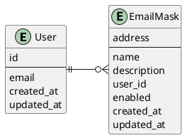
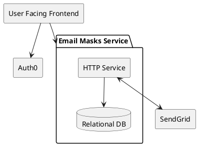

# Email Masker v1

## Summary

As stated in the [inception document](./Inception.MD), Email Masker
is an open-source project to help users have control of who is capable to
reach them through emails. This document describes the first implementation of Email Masker.

## Domain abstraction

To receive and delivery emails, the application should own a domain.
Moreover, because Email Masker is a project that values security and transparency,
the domain will be treated as an input variable throughout all the code.

## Receiving emails

SendGrid is an all-in-one service for managing emails.
Email Masker will use SendGrid's [Inbound Parse Webhook](https://docs.sendgrid.com/for-developers/parsing-email/setting-up-the-inbound-parse-webhook)
to receive emails as POST requests.

To accomplish this, Email Masker should have:

* A registered domain
* A hosted zone with a subdomain MX record pointing to SendGrid, the inbound subdomain.
* An endpoint capable of receiving POST requests from the internet, called the receiving endpoint.

### Receiving endpoint security

Because this endpoint can receive a request from the internet, it should
verify that the request comes from SendGrid, otherwise, the communication should be
terminated as soon as possible.

To achieve this, Email Masker will use the [Signed Webhook Feature](https://docs.sendgrid.com/for-developers/tracking-events/getting-started-event-webhook-security-features).
This feature adds a Header `X-Twilio-Email-Event-Webhook-Signature` to the post request which allows us to assert that the request
was originated from Twilio by using an asymmetric encryption method (Elliptic Curve Digital Signature Algorithm).
Twilio signs the request using a private key and the endpoint verifies the headers using the public key.
Twilio's [documentation](https://docs.sendgrid.com/for-developers/tracking-events/getting-started-event-webhook-security-features#verify-the-signature) includes much detail about how to do this verification.

### Receiving endpoint parameters

SendGrid parse webhook sends a multipart/form-data request to the endpoint.
In the context of accordingly redirecting the message, the most relevant parameters of this request are:

* From
* to
* Subject
* Text
* html
* attachments
* attachment-info

The files are present in the multipart/form-data request, and the number of files
can be identified with the `attachment` parameter, and the filenames along with other
metadata fields are located in `attachment-info`.

On the other hand, the `to` parameter will hold the *email mask* therefore,
it will be the input for the redirection mechanism

## Email masks mapping

The message redirection mechanism is based on a mapping from email masks
to the user's primary email address. Hence, email masks should have one and only
one owner.

<svg xmlns="http://www.w3.org/2000/svg" xmlns:xlink="http://www.w3.org/1999/xlink" contentStyleType="text/css" height="176px" preserveAspectRatio="none" style="width:275px;height:176px;background:#FFFFFF;" version="1.1" viewBox="0 0 275 176" width="275px" zoomAndPan="magnify"><defs/><g><!--MD5=[3fd616f346a44cd59a91eb10b19e157c]
class User--><g id="elem_User"><rect codeLine="3" fill="#F1F1F1" height="113.1875" id="User" rx="2.5" ry="2.5" style="stroke:#181818;stroke-width:0.5;" width="94" x="7" y="31.5"/><ellipse cx="35.95" cy="47.5" fill="#ADD1B2" rx="11" ry="11" style="stroke:#181818;stroke-width:1.0;"/><path d="M34.7469,48.375 L36.2,48.375 L36.2,48.4844 C36.2,48.8906 36.2313,49.0469 36.3094,49.2031 C36.4656,49.4531 36.7469,49.6094 37.0438,49.6094 C37.2938,49.6094 37.5594,49.4688 37.7156,49.25 C37.8406,49.0938 37.8719,48.9375 37.8719,48.4844 L37.8719,46.5625 C37.8719,46.4063 37.8719,46.3594 37.8563,46.2031 C37.7938,45.7344 37.4813,45.4219 37.0281,45.4219 C36.7781,45.4219 36.5125,45.5625 36.3406,45.7813 C36.2313,45.9531 36.2,46.1094 36.2,46.5625 L36.2,46.6875 L34.7469,46.6875 L34.7469,44.2813 L38.7313,44.2813 L38.7313,45.1406 C38.7313,45.5469 38.7625,45.7188 38.8406,45.875 C39.0125,46.125 39.2938,46.2813 39.575,46.2813 C39.8406,46.2813 40.1063,46.1406 40.2781,45.9219 C40.3875,45.75 40.4188,45.6094 40.4188,45.1406 L40.4188,42.5938 L32.7938,42.5938 C32.3563,42.5938 32.2313,42.6094 32.075,42.7031 C31.825,42.8594 31.6688,43.1563 31.6688,43.4375 C31.6688,43.7188 31.8094,43.9688 32.0281,44.1406 C32.1844,44.25 32.3719,44.2813 32.7938,44.2813 L33.0438,44.2813 L33.0438,50.7969 L32.7938,50.7969 C32.3875,50.7969 32.2313,50.8125 32.075,50.9219 C31.825,51.0938 31.6688,51.3594 31.6688,51.6563 C31.6688,51.9219 31.8094,52.1719 32.0281,52.3281 C32.1688,52.4531 32.4031,52.5 32.7938,52.5 L40.7938,52.5 L40.7938,49.9219 C40.7938,49.4844 40.7625,49.3438 40.6844,49.1875 C40.5125,48.9375 40.2313,48.7813 39.95,48.7813 C39.6844,48.7813 39.4188,48.8906 39.2469,49.1406 C39.1375,49.2969 39.1063,49.4375 39.1063,49.9219 L39.1063,50.7969 L34.7469,50.7969 L34.7469,48.375 Z " fill="#000000"/><text fill="#000000" font-family="sans-serif" font-size="14" lengthAdjust="spacing" textLength="31" x="53.05" y="52.3467">User</text><line style="stroke:#181818;stroke-width:0.5;" x1="8" x2="100" y1="63.5" y2="63.5"/><text fill="#000000" font-family="sans-serif" font-size="14" lengthAdjust="spacing" textLength="13" x="13" y="80.4951">id</text><line style="stroke:#181818;stroke-width:1.0;" x1="8" x2="100" y1="87.7969" y2="87.7969"/><text fill="#000000" font-family="sans-serif" font-size="14" lengthAdjust="spacing" textLength="39" x="13" y="104.792">email</text><text fill="#000000" font-family="sans-serif" font-size="14" lengthAdjust="spacing" textLength="78" x="13" y="121.0889">created_at</text><text fill="#000000" font-family="sans-serif" font-size="14" lengthAdjust="spacing" textLength="82" x="13" y="137.3857">updated_at</text></g><!--MD5=[60a85bc96d8e523948e0cc9e29205765]
class EmailMask--><g id="elem_EmailMask"><rect codeLine="11" fill="#F1F1F1" height="162.0781" id="EmailMask" rx="2.5" ry="2.5" style="stroke:#181818;stroke-width:0.5;" width="107" x="161" y="7"/><ellipse cx="176" cy="23" fill="#ADD1B2" rx="11" ry="11" style="stroke:#181818;stroke-width:1.0;"/><path d="M174.7969,23.875 L176.25,23.875 L176.25,23.9844 C176.25,24.3906 176.2813,24.5469 176.3594,24.7031 C176.5156,24.9531 176.7969,25.1094 177.0938,25.1094 C177.3438,25.1094 177.6094,24.9688 177.7656,24.75 C177.8906,24.5938 177.9219,24.4375 177.9219,23.9844 L177.9219,22.0625 C177.9219,21.9063 177.9219,21.8594 177.9063,21.7031 C177.8438,21.2344 177.5313,20.9219 177.0781,20.9219 C176.8281,20.9219 176.5625,21.0625 176.3906,21.2813 C176.2813,21.4531 176.25,21.6094 176.25,22.0625 L176.25,22.1875 L174.7969,22.1875 L174.7969,19.7813 L178.7813,19.7813 L178.7813,20.6406 C178.7813,21.0469 178.8125,21.2188 178.8906,21.375 C179.0625,21.625 179.3438,21.7813 179.625,21.7813 C179.8906,21.7813 180.1563,21.6406 180.3281,21.4219 C180.4375,21.25 180.4688,21.1094 180.4688,20.6406 L180.4688,18.0938 L172.8438,18.0938 C172.4063,18.0938 172.2813,18.1094 172.125,18.2031 C171.875,18.3594 171.7188,18.6563 171.7188,18.9375 C171.7188,19.2188 171.8594,19.4688 172.0781,19.6406 C172.2344,19.75 172.4219,19.7813 172.8438,19.7813 L173.0938,19.7813 L173.0938,26.2969 L172.8438,26.2969 C172.4375,26.2969 172.2813,26.3125 172.125,26.4219 C171.875,26.5938 171.7188,26.8594 171.7188,27.1563 C171.7188,27.4219 171.8594,27.6719 172.0781,27.8281 C172.2188,27.9531 172.4531,28 172.8438,28 L180.8438,28 L180.8438,25.4219 C180.8438,24.9844 180.8125,24.8438 180.7344,24.6875 C180.5625,24.4375 180.2813,24.2813 180,24.2813 C179.7344,24.2813 179.4688,24.3906 179.2969,24.6406 C179.1875,24.7969 179.1563,24.9375 179.1563,25.4219 L179.1563,26.2969 L174.7969,26.2969 L174.7969,23.875 Z " fill="#000000"/><text fill="#000000" font-family="sans-serif" font-size="14" lengthAdjust="spacing" textLength="75" x="190" y="27.8467">EmailMask</text><line style="stroke:#181818;stroke-width:0.5;" x1="162" x2="267" y1="39" y2="39"/><text fill="#000000" font-family="sans-serif" font-size="14" lengthAdjust="spacing" textLength="55" x="167" y="55.9951">address</text><line style="stroke:#181818;stroke-width:1.0;" x1="162" x2="267" y1="63.2969" y2="63.2969"/><text fill="#000000" font-family="sans-serif" font-size="14" lengthAdjust="spacing" textLength="40" x="167" y="80.292">name</text><text fill="#000000" font-family="sans-serif" font-size="14" lengthAdjust="spacing" textLength="82" x="167" y="96.5889">description</text><text fill="#000000" font-family="sans-serif" font-size="14" lengthAdjust="spacing" textLength="50" x="167" y="112.8857">user_id</text><text fill="#000000" font-family="sans-serif" font-size="14" lengthAdjust="spacing" textLength="58" x="167" y="129.1826">enabled</text><text fill="#000000" font-family="sans-serif" font-size="14" lengthAdjust="spacing" textLength="78" x="167" y="145.4795">created_at</text><text fill="#000000" font-family="sans-serif" font-size="14" lengthAdjust="spacing" textLength="82" x="167" y="161.7764">updated_at</text></g><!--MD5=[dcf4b5a64799d345cb54e70fd04bc891]
link User to EmailMask--><g id="link_User_EmailMask"><path codeLine="22" d="M109.296,88 C123.21,88 138.266,88 152.494,88 " fill="none" id="User-EmailMask" style="stroke:#181818;stroke-width:1.0;"/><line style="stroke:#181818;stroke-width:1.0;" x1="152.76" x2="160.76" y1="88" y2="82"/><line style="stroke:#181818;stroke-width:1.0;" x1="152.76" x2="160.76" y1="88" y2="94"/><line style="stroke:#181818;stroke-width:1.0;" x1="152.76" x2="160.76" y1="88" y2="88"/><ellipse cx="146.76" cy="88" fill="none" rx="4" ry="4" style="stroke:#181818;stroke-width:1.0;"/><line style="stroke:#181818;stroke-width:1.0;" x1="105.2708" x2="105.2708" y1="92" y2="84"/><line style="stroke:#181818;stroke-width:1.0;" x1="108.2708" x2="108.2708" y1="92" y2="84"/><line style="stroke:#181818;stroke-width:1.0;" x1="109.2708" x2="101.2708" y1="88" y2="88"/></g><!--MD5=[db2b33fd41e1bd23c44a36eddabf197f]
--></g></svg>

Moreover, email masks hold an enabled field that indicates if the messages should be
redirected to the owner's email address or not. As a consequence, the user can choose
to ignore emails at any moment without having to lose the email mask.

## Infrastructure

### Cloud independence

To maintain this project deployable to any cloud,
Email Masker will leverage the power of Kubernetes.
The project is divided into two main components.

* User Facing Frontend is in charge of interacting with the end-user,
  should be capable of authenticating the user and letting them manage their email masks.
* Email Masks Service is capable of receiving inbound emails through SendGrid and
  handling the mappings between masks and users.

The authentication is done by using Auth0, this service allows the application
to handle logins and JWT authentication without having to implement it inside this project.

<svg xmlns="http://www.w3.org/2000/svg" xmlns:xlink="http://www.w3.org/1999/xlink" contentStyleType="text/css" height="282px" preserveAspectRatio="none" style="width:415px;height:282px;background:#FFFFFF;" version="1.1" viewBox="0 0 415 282" width="415px" zoomAndPan="magnify"><defs/><g><!--MD5=[0041867f107ef9036c68ea859b6e8297]
cluster EMS--><g id="cluster_EMS"><path d="M121,67 L285,67 A3.75,3.75 0 0 1 287.5,69.5 L294.5,89.2969 L297,89.2969 A2.5,2.5 0 0 1 299.5,91.7969 L299.5,272.5 A2.5,2.5 0 0 1 297,275 L121,275 A2.5,2.5 0 0 1 118.5,272.5 L118.5,69.5 A2.5,2.5 0 0 1 121,67 " style="stroke:#000000;stroke-width:1.5;fill:none;"/><line style="stroke:#000000;stroke-width:1.5;fill:none;" x1="118.5" x2="294.5" y1="89.2969" y2="89.2969"/><text fill="#000000" font-family="sans-serif" font-size="14" font-weight="bold" lengthAdjust="spacing" textLength="163" x="122.5" y="81.9951">Email Masks Service</text></g><!--MD5=[6a726c4e61ce62ba3a419f851e7e4e3b]
entity EMSDB--><g id="elem_EMSDB"><path d="M158,216 C158,206 216.5,206 216.5,206 C216.5,206 275,206 275,216 L275,241.2969 C275,251.2969 216.5,251.2969 216.5,251.2969 C216.5,251.2969 158,251.2969 158,241.2969 L158,216 " fill="#F1F1F1" style="stroke:#181818;stroke-width:0.5;"/><path d="M158,216 C158,226 216.5,226 216.5,226 C216.5,226 275,226 275,216 " fill="none" style="stroke:#181818;stroke-width:0.5;"/><text fill="#000000" font-family="sans-serif" font-size="14" lengthAdjust="spacing" textLength="97" x="168" y="242.9951">Relational DB</text></g><!--MD5=[cb3e151f375c1fb55c4b5bc8f0aaea11]
entity EMSAPI--><g id="elem_EMSAPI"><rect fill="#F1F1F1" height="36.2969" rx="2.5" ry="2.5" style="stroke:#181818;stroke-width:0.5;" width="114" x="161.5" y="110"/><text fill="#000000" font-family="sans-serif" font-size="14" lengthAdjust="spacing" textLength="94" x="171.5" y="132.9951">HTTP Service</text></g><!--MD5=[194a92f280a7d2c2f105939ff984a7cf]
entity Frontend--><g id="elem_Frontend"><rect fill="#F1F1F1" height="36.2969" rx="2.5" ry="2.5" style="stroke:#181818;stroke-width:0.5;" width="171" x="7" y="7"/><text fill="#000000" font-family="sans-serif" font-size="14" lengthAdjust="spacing" textLength="151" x="17" y="29.9951">User Facing Frontend</text></g><!--MD5=[00a92c95c44691d3b1fbb9e363f30ea2]
entity SendGrid--><g id="elem_SendGrid"><rect fill="#F1F1F1" height="36.2969" rx="2.5" ry="2.5" style="stroke:#181818;stroke-width:0.5;" width="86" x="323.5" y="210.5"/><text fill="#000000" font-family="sans-serif" font-size="14" lengthAdjust="spacing" textLength="66" x="333.5" y="233.4951">SendGrid</text></g><!--MD5=[031b45bc4b16005b8fb2ce0f270abe18]
entity Auth0--><g id="elem_Auth0"><rect fill="#F1F1F1" height="36.2969" rx="2.5" ry="2.5" style="stroke:#181818;stroke-width:0.5;" width="63" x="28" y="110"/><text fill="#000000" font-family="sans-serif" font-size="14" lengthAdjust="spacing" textLength="43" x="38" y="132.9951">Auth0</text></g><!--MD5=[fe66845bc2cb36a34f9af5e13740826d]
link Frontend to Auth0--><g id="link_Frontend_Auth0"><path d="M86.902,43.133 C81.3552,60.11 72.8332,86.192 66.7669,104.759 " fill="none" id="Frontend-to-Auth0" style="stroke:#181818;stroke-width:1.0;"/><polygon fill="#181818" points="65.1255,109.783,71.7228,102.4703,66.6783,105.0302,64.1184,99.9858,65.1255,109.783" style="stroke:#181818;stroke-width:1.0;"/></g><!--MD5=[42a845d5c0ca0ee2983f2ef62d1574d3]
link Frontend to EMS--><g id="link_Frontend_EMS"><path d="M104.4759,43.07 C105.9746,45.652 107.374,48.343 108.5,51 C111.781,58.7403 114.5286,67.1891 116.8086,75.5492 C117.3786,77.6393 117.9194,79.7238 118.432,81.7903 " fill="none" id="Frontend-to-EMS" style="stroke:#181818;stroke-width:1.0;"/><polygon fill="#181818" points="118.432,81.7903,120.1476,72.092,117.2283,76.9374,112.3829,74.0181,118.432,81.7903" style="stroke:#181818;stroke-width:1.0;"/></g><!--MD5=[915ef87c8acb35cf848e2bebf9fb662c]
link EMSAPI to EMSDB--><g id="link_EMSAPI_EMSDB"><path d="M218.152,146.157 C217.847,161.143 217.401,183.15 217.048,200.4954 " fill="none" id="EMSAPI-to-EMSDB" style="stroke:#181818;stroke-width:1.0;"/><polygon fill="#181818" points="216.942,205.716,221.124,196.7991,217.0436,200.717,213.1256,196.6366,216.942,205.716" style="stroke:#181818;stroke-width:1.0;"/></g><!--MD5=[3e254faec43514cb950ca25bad6a845d]
link EMSAPI to SendGrid--><g id="link_EMSAPI_SendGrid"><path d="M248.506,148.97 C274.045,165.967 310.559,190.269 336.185,207.3243 " fill="none" id="EMSAPI-SendGrid" style="stroke:#181818;stroke-width:1.0;"/><polygon fill="#181818" points="340.519,210.2087,335.2425,201.8925,336.3565,207.4386,330.8104,208.5526,340.519,210.2087" style="stroke:#181818;stroke-width:1.0;"/><polygon fill="#181818" points="244.28,146.157,249.5549,154.4742,248.442,148.9279,253.9883,147.8149,244.28,146.157" style="stroke:#181818;stroke-width:1.0;"/></g><!--MD5=[11bd8a028557897100fbe36d0e253dd2]
--></g></svg>

Inside this proposal of Email Masker, the receiving email endpoint will also send the mail to the corresponding owner,
having no system intermediaries like queues. This design decision is made to prevent overengineering the first version of the project.

On the other hand, the Cloud provider choosen to kickstart Email Masker is Digital Ocean.
They offer managed kubernetes, relational databases, and load balancers.

## Tech Stack

* Go
  * Fiber
* Typescript
  * Next.js (static site generation)
  * React
