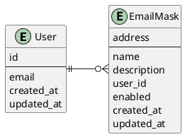

# Email Masker v1

## Summary

As stated in the [inception document](./Inception.MD), Email Masker
is an open-source project to help users have control of who is capable to
reach them through emails. This document describes the first implementation of Email Masker.

## Domain abstraction

## Receiving emails

SendGrid is an all-in-one service for managing emails.
Email Masker will use SendGrid's [Inbound Parse Webhook](https://docs.sendgrid.com/for-developers/parsing-email/setting-up-the-inbound-parse-webhook)
to receive emails as POST requests.

To accomplish this, Email Masker should have:

* A registered domain
* A hosted zone with a subdomain MX record pointing to SendGrid, the inbound subdomain.
* An endpoint capable of receiving POST requests from the internet, called the receiving endpoint.

### Receiving endpoint security

Because this endpoint can receive a request from the internet, it should
verify that the request comes from SendGrid, otherwise, the communication should be
terminated as soon as possible.

To achieve this, Email Masker will use the [Signed Webhook Feature](https://docs.sendgrid.com/for-developers/tracking-events/getting-started-event-webhook-security-features).
This feature adds a Header `X-Twilio-Email-Event-Webhook-Signature` to the post request which allows us to assert that the request
was originated from Twilio by using an asymmetric encryption method (Elliptic Curve Digital Signature Algorithm).
Twilio signs the request using a private key and the endpoint verifies the headers using the public key.
Twilio's [documentation](https://docs.sendgrid.com/for-developers/tracking-events/getting-started-event-webhook-security-features#verify-the-signature) includes much detail about how to do this verification.

### Receiving endpoint parameters

SendGrid parse webhook sends a multipart/form-data request to the endpoint.
In the context of accordingly redirecting the message, the most relevant parameters of this request are:

* From
* to
* Subject
* Text
* html
* attachments
* attachment-info

The files are present in the multipart/form-data request, and the number of files
can be identified with the `attachment` parameter, and the filenames along with other
metadata fields are located in `attachment-info`.

On the other hand, the `to` parameter will hold the *email mask* therefore,
it will be the input for the redirection mechanism

## Email masks mapping

The message redirection mechanism is based on a mapping from email masks
to the user's primary email address. Hence, email masks should have one and only
one owner.

Moreover, email masks hold an enabled field that indicates if the messages should be
redirected to the owner's email address or not. As a consequence, the user can choose
to ignore emails at any moment without having to lose the email mask.

## Infrastructure
